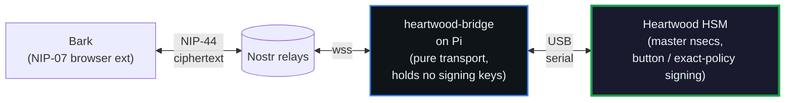

# Heartwood ESP32

[](https://github.com/sponsors/TheCryptoDonkey)

A hardware signing device for Nostr on supported ESP32 boards: **Heltec WiFi LoRa 32 V3/V4**, **LilyGO/TENSTAR T-Display**, and **Waveshare ESP32-C6-LCD-1.47**. Pick the target with the board-aware build script. Heartwood holds multi-master nsec material and signs on request; master private keys never leave the chip. Signing is policy-gated: requests outside automatic authority need the physical button and are shown on the display, while an authenticated operator can install an exact per-client method/event-kind policy for unattended signing.

For the full architecture walkthrough with sequence diagrams and trust-boundary analysis, see [**docs/architecture.md**](docs/architecture.md).

The shared `common` crate (derivation, NIP-44/46, policy — `no_std`, host-tested) also powers [heartwood-ledger](https://github.com/forgesworn/heartwood-ledger), the same signer as a Ledger embedded app: same seed phrase, same npub, same personas, with curve operations on the secure element via the `ledger-backend` feature.



The device is always the component that produces the signature. Authority comes from either a physical button approval or a previously installed slot policy. New remotely managed v2 slots are exact and fail closed: methods and event kinds outside their ceiling are denied, while matching requests can run unattended only when `auto_approve=true`. The Pi-side bridge holds no master key and cannot expand that authority. The separate Sapwood operator key is more powerful: it can create/revoke clients and install a signing policy, so compromise of that key must be treated as compromise of the configured remote-management authority.

Deployment modes, selected at runtime from the NVS network config:

### Home HSM — USB-attached to a Raspberry Pi *(shipped)*

Holds the **master secrets** (up to 8 masters across bunker / tree-mnemonic / tree-nsec modes). All radios are disabled in this mode. The Pi running `heartwood-bridge` handles networking (Nostr relays, NIP-46 transport). The ESP32 handles all cryptography — decryption, signing, envelope construction. A compromised Pi cannot extract a master key or broaden a slot policy; an already-authorised client can still receive whatever signatures its current policy permits. Management UI via [Sapwood](https://github.com/forgesworn/sapwood) is served by the bridge.

### WiFi-standalone — on-chip relay client, no Pi *(shipped, opt-in)*

The ESP32 joins WiFi and connects to Nostr relays directly, running the full NIP-46 signing loop on-chip (`firmware/src/relay.rs`) — no Raspberry Pi. Keys still never leave the chip and NIP-44 is still decrypted on-device. Exact v2 client policies can permit unattended signing for a bounded method/event-kind set; other requests are denied or require the OLED/button according to their legacy policy. An unbound relay peer cannot enter the 30-second button loop: remote physical approval is available only after the client has been provisioned and slot-bound, so strangers cannot keep a shelf signer busy with prompts. Enabled only when the device is provisioned with an SSID + relay list (`mode="wifi"` in the NVS net config); the USB cable stays fully usable in parallel, so a bad SSID or relay is recoverable over the cable. Relay-side device management (kind 24134) is authenticated to a provisioned operator pubkey, uses a durable one-time mutation challenge, and can manage clients and staged WiFi changes remotely. USB can read password-redacted network/operator state, patch network fields with keep/set/clear password semantics, and replace the operator only through a separate stale-revision-checked physical confirmation. Seed replacement, PIN changes, factory reset, and OTA remain local/USB operations.

This is the convenience tier — it accepts a larger attack surface (a live TCP/IP stack on a key-holding device) in exchange for dropping the Pi. The USB-attached mode above remains the high-assurance default; leave the radios off where that matters.

### Portable signer — battery-powered, BLE to phone *(roadmap)*

Holds a **child key** derived by the home HSM (`purpose="device/mobile"`). Only BLE enabled — short range, requires physical proximity. If lost or compromised, burn that branch on the HSM and derive a new one at the next index. The master secret and all other branches are untouched.

### Key hierarchy

```
Master secret (home HSM)
├── persona/social       — public Nostr identity
├── persona/forgesworn   — project identity
├── client/bray          — NIP-46 client key
├── device/mobile-0      — portable signer #0 ← child key lives here
├── device/mobile-1      — replacement if #0 is compromised
└── ...
```

The nsec-tree hierarchy means each device gets its own branch. Compromise of a child never threatens the root or siblings.

## Hardware

| Component | Detail |
|-----------|--------|
| Boards | Heltec WiFi LoRa 32 V3/V4; LilyGO/TENSTAR T-Display; Waveshare ESP32-C6-LCD-1.47 |
| Chip | ESP32-S3 (Heltec), classic ESP32 (T-Display), or ESP32-C6 (Waveshare) |
| Display | 128x64 SSD1306 OLED (Heltec), ST7789 TFT (T-Display), or JD9853 TFT (Waveshare C6) |
| GNSS | L76K on V4 only (available for portable mode) |
| LoRa | SX1262 (never initialised -- no use case for signing) |
| WiFi | Built in (off in USB-bridged mode; enabled in WiFi-standalone mode) |
| BLE | Built in (reserved for future portable mode; not built) |
| USB-C (V4) | Wired direct to native USB-Serial-JTAG on GPIO19/20 |
| USB-C (V3) | Wired through CP2102 bridge to UART0 on GPIO43/44 |
| Battery | JST PH 2.0 connector + charging circuit (portable mode) |
| Buttons | Board-specific local confirmation controls; T-Display provides two buttons |

## Setup

Install the ESP Rust toolchain:

```bash
cargo install espup ldproxy espflash
espup install
source ~/export-esp.sh
```

## Build

Three independent crates -- build each from its own directory:

```bash
cd common && cargo test                    # shared crypto tests
cd provision && cargo build                # host CLI tool
cd firmware && cargo build                 # ESP32 firmware (V4 default)
```

The firmware crate selects its board at compile time. The default cargo feature
is `heltec-v4`, but production builds should use the wrapper so the cargo
feature, target triple, MCU, and sdkconfig fragment cannot drift apart:

```bash
./scripts/build-firmware.sh v3 --release
./scripts/build-firmware.sh v4 --release
./scripts/build-firmware.sh tdisplay --release
./scripts/build-firmware.sh c6 --release
```

Or the manual form:

```bash
cd firmware
# V4 (default)
cargo build --release
# V3
ESP_IDF_SDKCONFIG_DEFAULTS="sdkconfig.defaults;sdkconfig.defaults.heltec-v3" \
    cargo build --release --no-default-features --features heltec-v3
```

The wrapper script also writes a board-tagged ELF copy to
`target/heartwood-<board>.elf` so you cannot accidentally flash the wrong
binary onto the wrong hardware.

## Flash & provision

### Direct flash (USB cable to build machine)

```bash
# Heltec V4 (default, native USB CDC, enumerates as /dev/ttyACM*)
./scripts/build-firmware.sh v4 --release
espflash flash firmware/target/xtensa-esp32s3-espidf/release/heartwood-esp32

# Heltec V3 (CP2102 bridge, typically enumerates as /dev/ttyUSB* or /dev/cu.usbserial-*)
./scripts/build-firmware.sh v3 --release
espflash flash firmware/target/xtensa-esp32s3-espidf/release/heartwood-esp32
```

**Always use `--release`** -- debug builds (~2.2MB) exceed the 1.5MB OTA partition.

### Remote flash via esptool (ESP32 attached to a Pi)

Build the app binary locally, transfer it, and flash with esptool on the Pi.

**Serial port naming depends on the board.** V4 enumerates as USB CDC
(`/dev/ttyACM0` on Linux) because it uses the ESP32-S3's native USB. V3
goes through a CP2102 UART bridge and enumerates as `/dev/ttyUSB0`.
Substitute the right path in the commands below.

```bash
# Build and convert to app binary (0xE9 format, not raw ELF)
./scripts/build-firmware.sh v4 --release      # or: v3
espflash save-image --chip esp32s3 firmware/target/xtensa-esp32s3-espidf/release/heartwood-esp32 /tmp/heartwood-esp32.bin

# Transfer to the Pi
scp /tmp/heartwood-esp32.bin pi-host:/tmp/

# On the Pi: stop any process holding the serial port, then flash.
# PORT=/dev/ttyACM0 for V4, PORT=/dev/ttyUSB0 for V3.
PORT=/dev/ttyACM0
sudo systemctl stop <heartwood-services>
sudo fuser -k "$PORT"
python3 -m esptool --chip esp32s3 --port "$PORT" --before default-reset \
  write-flash 0x10000 /tmp/heartwood-esp32.bin

# Erase otadata to force boot from ota_0
python3 -m esptool --chip esp32s3 --port "$PORT" --before default-reset \
  erase-region 0xd000 0x2000
```

**Important:** if any daemon holds the serial port, the flash will fail mid-write. Use `systemctl mask` (not just `stop`) if services auto-restart, and stop `ModemManager` which probes new serial devices on USB re-enumeration.

### OTA update (over serial, device already running)

```bash
# Stop the daemon holding the serial port
sudo systemctl stop <heartwood-service>

# Flash via OTA (requires button approval on the device -- hold 2s).
# PORT=/dev/ttyACM0 for V4, PORT=/dev/ttyUSB0 for V3.
heartwood-ota --port /dev/ttyACM0 --firmware /tmp/heartwood-esp32.bin

# Restart the daemon
sudo systemctl start <heartwood-service>
```

The OTA tool is built from the `ota/` crate. The firmware binary must be an app binary (use `espflash save-image`), not the raw ELF from `cargo build`.

### Provision

After first flash, wait for OLED to show "Awaiting secret...", then:

```bash
cd provision && cargo run -- --port /dev/cu.usbserial-*
```

Enter mnemonic and passphrase when prompted. After ACK, the device reboots with the stored identity.

To restore an existing key rather than a phrase, pick a mode: `--mode bunker`
(the device signs as that exact key, same npub) or `--mode tree-nsec` (a fresh
tree root is derived from it, new npub). Both prompt for the key and accept
either an `nsec1...` or the 24-word key backup Sapwood writes out at import --
the key's own bytes as BIP-39 entropy, so the identical npub comes back. A
12-word phrase is a seed, not a key, and belongs in the default tree-mnemonic
mode. Format and instructions:
[sapwood/docs/key-backup.md](https://github.com/forgesworn/sapwood/blob/main/docs/key-backup.md).

Subsequent boots display the master npub immediately (no provisioning needed).

## Test vector

| Parameter | Value |
|-----------|-------|
| Root secret | `[0x01, 0x02, ..., 0x20]` (32 bytes, sequential) |
| Root path | Raw secret → SigningKey (no HMAC intermediate) |
| Purpose | `persona/test` |
| Index | `0` |
| Expected child npub | `npub1rx8u4wk9ytu8aak4f9wcaqdgk0lj4rjhdu4j9n7dj2mg68l9cdqs2fjf2t` |

This must match heartwood-core's output for the same inputs. The nsec-tree derivation is:

```
context = b"nsec-tree\0" || b"persona/test" || 0x00 || 0x00000000
child_secret = HMAC-SHA256(key=root_secret, msg=context)
child_pubkey = SigningKey(child_secret).verifying_key()
npub = bech32_encode("npub", child_pubkey)
```

## GPIO safety

Verified against Heltec factory test code, Meshtastic firmware, and ESPHome configs:

- **GPIO 17, 18, 21** -- OLED I2C, shared wiring on both V3 and V4.
- **GPIO 19, 20** -- native USB D-/D+ on V4. Not wired to USB-C on V3, so `UsbSerialDriver` will never enumerate on V3; the V3 code path uses UART0 instead.
- **GPIO 43, 44** -- UART0 TX/RX on both boards, but only V3 has them wired through to the USB-C port via the CP2102 bridge.
- **PSRAM pins** on ESP32-S3R2 (V4 only) are GPIO 26-32 (quad-SPI). Nowhere near our I2C pins. The V3 has no PSRAM.
- **GPIO 33-37** are free on both boards (only reserved on octal PSRAM variants like S3R8).

## Structure

```
common/                  Shared crypto, frame protocol, NIP-46/44/04 types
  src/
    lib.rs, derive.rs, encoding.rs, types.rs, hex.rs, frame.rs
    nip46.rs            NIP-46 event types, canonical serialisation, event id
    nip44.rs            NIP-44 v2 (XChaCha20 + HMAC-SHA256, conversation key)
    nip04.rs            NIP-04 legacy (AES-256-CBC)
firmware/                ESP32 firmware (NIP-46 signing bunker)
  src/
    main.rs             Boot flow → PIN unlock → frame dispatch loop
    sign.rs             BIP-340 Schnorr signing (secp256k1 C FFI)
    nvs.rs              NVS read/write for masters, bridge secret, policies, PIN
    provision.rs        Multi-master provisioning (add/remove/list)
    transport.rs        0x10 encrypted requests + 0x34 SIGN_ENVELOPE handler
    session.rs          Bridge session auth (0x21/0x22) + SET_BRIDGE_SECRET (0x23)
    policy.rs           Client approval policies, two-tier TOFU
    ota.rs              Serial OTA (0x30-0x33) with SHA-256 + auto-rollback
    pin.rs              Boot PIN, NVS-persisted failed-attempt counter
    nip46_handler.rs    NIP-46 dispatch (sign_event, connect, NIP-44/04, heartwood_*)
    identity_cache.rs   Derived persona cache for tree-mode masters
    approval.rs         Button approval loop with OLED countdown
    oled.rs             SSD1306 display helpers, boot animation
    masters.rs          LoadedMaster lookup, npub encoding
  build.rs, sdkconfig.defaults, rust-toolchain.toml, .cargo/config.toml
provision/               Host CLI tool
  src/
    main.rs             Mnemonic / nsec / hex → serial push to device
sign-test/               Signing test harness
  src/
    main.rs             Send NIP-46 requests over serial, display responses
heartwoodd/              Pi-side daemon (formerly bridge/)
  src/
    main.rs             Nostr relay ↔ NIP-44 transport ↔ serial ↔ ESP32
                        Master-routed, calls SIGN_ENVELOPE for outer events
    api.rs              Management HTTP API on :3100, bearer-token auth
    backend/            Soft mode (sealed keyfile) and hard mode (serial) backends
ota/                     Pi-side serial OTA tool
  src/
    main.rs             Chunked firmware upload with SHA-256 verification
scripts/
  setup-hsm.py          Interactive provisioning and bridge-start helper
  git-hooks/            Pre-commit secret scanner (64-hex + nsec1 detection)
  install-hooks.sh      Installer for the git hooks
docs/
  architecture.md       System architecture with mermaid diagrams
  plans/                Design notes, including the zero-trust bridge refactor plan
  specs/                Protocol specs
```

## Roadmap

### Phase 1 — Prove the crypto (current spike)

- [x] nsec-tree HMAC-SHA256 derivation on ESP32-S3
- [x] bech32 npub encoding
- [x] Runtime assertion against heartwood-core test vectors
- [x] Display npub on OLED
- [x] Sign a dummy 32-byte hash and display the signature

### Phase 2 — Provisioning

- [x] CLI tool to derive 32-byte root secret from mnemonic + passphrase (offline PC)
- [x] NVS storage for root secret (plaintext — encryption deferred, see excluded)
- [x] First-boot provisioning mode: accept root secret over USB serial
- [x] Subsequent boots read from NVS, skip provisioning
- [x] Show master npub on OLED after boot

### Phase 3 — USB signing oracle

- [x] NIP-46 JSON-RPC over serial (ESP32 is the bunker, Pi is a transport bridge)
- [x] Unified frame protocol: `[magic][type][length][payload][crc32]`
- [x] OLED shows what you're signing (identity, event kind, content preview, countdown)
- [x] Physical button: long hold (>=2s) to approve, short press to deny, 30s timeout
- [x] Per-request child key derivation with Heartwood extension field
- [x] Test harness CLI (`sign-test/`) for end-to-end validation
- [x] Flash and verify end-to-end signing flow on hardware (2026-04-03)
- [x] Pi-side relay bridge (`bridge/`) — NIP-46 over Nostr relays ←→ NIP-44 ←→ serial ←→ ESP32

### Phase 4 — Full NIP-46 HSM *(shipped)*

- [x] Multi-master NVS storage (up to 8 masters, three modes: bunker/tree-mnemonic/tree-nsec)
- [x] Extended provisioning protocol (add/remove/list masters with mode + label)
- [x] NIP-44 v2 on-device (conversation key derivation + XChaCha20 + HMAC-SHA256)
- [x] NIP-04 legacy on-device (AES-256-CBC)
- [x] Zero-trust Pi transport (ESP32 decrypts inbound 0x10 frames, Pi only sees ciphertext)
- [x] Bridge session authentication (shared secret, constant-time comparison)
- [x] Client approval policies (per-master, per-client, RAM-only, pushed from bridge)
- [x] Policy engine (auto-approve / OLED-notify / button-required tiers)
- [x] NIP-46 core methods plus Heartwood extension dispatch (proof generation/verification currently return explicit `not yet implemented` errors)
- [x] Multi-master OLED UX (boot screen, bridge status, master labels, auto-approve flash)
- [x] Bridge passthrough mode (0x10/0x11 encrypted frames, fallback to legacy)
- [x] `connect` method with per-master connect secret validation + two-tier TOFU
- [x] Encrypted response flow (handler returns JSON, transport encrypts 0x11)
- [x] NIP-44/NIP-04 encrypt/decrypt method bodies

### Phase 5 — Hardening *(shipped)*

- [x] Serial OTA with SHA-256 verification and automatic rollback
- [x] Factory reset with button confirmation
- [x] PIN lock with NVS-persisted failed-attempt counter
- [ ] Rate limiting in policy engine (per-client counter exists in `ClientSession` but is not yet wired into the request dispatch path)
- [x] Mutual-exclusivity guard between device-decrypts and legacy modes
- [x] Bearer token auth on bridge management API
- [x] Bridge secrets read from env vars via `clap env = ...`, never enter argv or `/proc/cmdline`
- [x] Radios off in USB-bridged mode — LoRa/BLE never initialised; WiFi initialised only in the opt-in WiFi-standalone mode
- [ ] JTAG disable in production build
- [ ] Watchdog enablement (post-provisioning)
- [ ] `cargo deny` setup — licence checking, security advisories, crate bans

### Phase 6 — Zero-trust bridge *(shipped 2026-04-05)*

- [x] `SIGN_ENVELOPE` frame (0x34) — HSM builds and signs NIP-46 kind:24133 envelope events on-device
- [x] Bridge queries device for master list at startup via `PROVISION_LIST`
- [x] Bridge routes NIP-46 traffic to the real master pubkey (no Pi-side bunker identity masquerade)
- [x] Pi-side `bunker_keys` demoted to ephemeral relay-layer transport identity with no signing authority
- [x] `EventBuilder::sign_with_keys` replaced with device round-trip in the response path
- [x] 1.5 MB OTA partition slots (up from 896 KB) — accommodates current firmware size with 50% headroom
- [ ] Dedicated on-device transport key distinct from user masters
- [ ] NIP-46 transport architecture spec contribution

### Phase 7 — Portable signer

- [ ] Cargo feature flags: `hsm` (default, USB-only) vs `portable` (BLE, battery)
- [ ] HSM provisions a child key onto the portable device (`device/mobile-N`)
- [ ] BLE GATT service: NIP-46 request/response profile
- [ ] Phone pairs to device over BLE
- [ ] OLED shows signing request details, button to approve/deny
- [ ] Battery management: deep sleep between requests, wake on BLE connect
- [ ] Child key revocation: HSM increments index, re-provisions replacement device

### Phase 8 — Portable extras (stretch)

- [ ] GPS location stamp on signed events (opt-in, portable mode only)
- [ ] QR code display of npub on OLED
- [ ] Multi-identity: carry several child keys, select on OLED before signing

### Deliberately excluded

- **WiFi signing as the default** — the high-assurance default keeps all radios off and networks via the USB-attached Pi; a live TCP/IP stack is a real liability on a key-holding device. WiFi is off unless you explicitly opt into WiFi-standalone mode (see above), which trades that surface for dropping the Pi.
- **Master secret on portable device** — only child keys leave the home HSM. If the portable device is lost, the damage is one branch.
- **LoRa signing** — signing is a response to a request, and the requester needs internet anyway. LoRa solves a problem that doesn't exist for this use case. The SX1262 is never initialised (safe without antenna).
- **Flash encryption / eFuse burning** — permanently locks the chip to one firmware, prevents reuse (e.g. Meshtastic), and risks bricking if anything goes wrong. Physical security is the protection model instead. May revisit on a dedicated production unit.

## Part of the ForgeSworn Toolkit

[ForgeSworn](https://forgesworn.dev) builds open-source cryptographic identity, payments, and coordination tools for Nostr.

| Library | What it does |
|---------|-------------|
| [nsec-tree](https://github.com/forgesworn/nsec-tree) | Deterministic sub-identity derivation |
| [ring-sig](https://github.com/forgesworn/ring-sig) | SAG/LSAG ring signatures on secp256k1 |
| [range-proof](https://github.com/forgesworn/range-proof) | Pedersen commitment range proofs |
| [canary-kit](https://github.com/forgesworn/canary-kit) | Coercion-resistant spoken verification |
| [spoken-token](https://github.com/forgesworn/spoken-token) | Human-speakable verification tokens |
| [toll-booth](https://github.com/forgesworn/toll-booth) | L402 payment middleware |
| [geohash-kit](https://github.com/forgesworn/geohash-kit) | Geohash toolkit with polygon coverage |
| [nostr-attestations](https://github.com/forgesworn/nostr-attestations) | NIP-VA verifiable attestations |
| [dominion](https://github.com/forgesworn/dominion) | Epoch-based encrypted access control |
| [nostr-veil](https://github.com/forgesworn/nostr-veil) | Privacy-preserving Web of Trust |
