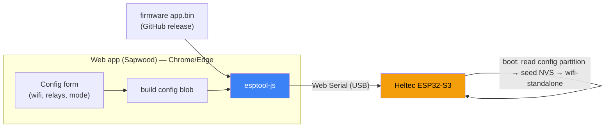

# Web flasher: flash-and-configure onboarding (Raspberry Pi Imager model)

**Status:** Draft / Proposed — spec for review, not yet implemented.
**Date:** 2026-06-19
**Repos:** `heartwood-esp32` (firmware + partition table), `sapwood` (the web app that flashes).
**Related:** `heartwood/docs/2026-06-19-relay-mediated-management.md` (heap-feasibility spike, NVS net-config, wifi-scan frames).

> **Provenance.** This crystallises a direction the user reached after repeatedly hitting "device rejected the config": *flash and configure in one web step, like the Raspberry Pi Imager.* It is the architectural fix to that friction — see [Why this kills the friction](#why-this-kills-the-friction).

---

## The idea

Configure **before** flashing, bake the config into the image, and write both in one **Flash & Configure** action from the browser. The device boots already configured. This is exactly the Raspberry Pi Imager model (set wifi/SSH/hostname → write to the SD card → the Pi boots pre-configured), applied to the ESP32 over Web Serial.

## Why this kills the friction

Every "device rejected the config" this session came from configuring **after** boot: Sapwood pushes a `SET_NET_CONFIG` (0x54) frame, the device must already be in the right state to accept it, and a blank device sits in provision-wait and NACKs everything (`firmware/src/main.rs:219`). Post-boot configuration is an ordering problem.

Flash-and-configure removes the ordering entirely: the config is **present in flash before the first boot**, so there is no frame to reject, no provision-wait race, no button-approval timing. The failure mode cannot occur by construction.

## Architecture



In one flashing operation, `esptool-js` writes:
1. the **firmware app** (to `ota_0`), and optionally the bootloader + partition table if the layout changed, and
2. a **config blob** (to a new `config` partition — see below).

Then it resets the chip. The firmware reads the config partition at boot and brings up wifi-standalone with no further interaction.

## Partition layout change

Current table (`firmware/partitions.csv`, 8 MB flash, ~3.95 MB free):

```
nvs,       data, nvs,     ,  0x4000     # 0x9000
otadata,   data, ota,     ,  0x2000     # 0xD000
phy_init,  data, phy,     ,  0x1000     # 0xF000
ota_0,     app,  ota_0,   ,  0x200000   # 0x10000
ota_1,     app,  ota_1,   ,  0x200000   # 0x210000
                                        # 0x410000..0x800000 free (~3.95 MB)
```

Add a small **`config`** data partition (appended → no existing offset moves):

```
config,    data, 0x40,    ,  0x4000     # 0x410000, 16 KB, custom subtype
```

16 KB is vastly more than needed (`NetConfig` JSON is < 512 B today, capped by `NET_CONFIG_MAX_LEN`), leaving headroom for future flash-time settings (hostname, master metadata, etc.). A custom data subtype (`0x40`) keeps it distinct from `nvs`.

> Changing the partition table is a full-reflash boundary — which is fine, because the flasher *is* a full flash. Devices are never OTA-updated across this.

## Config blob format

Keep it dead simple — raw, browser-generatable, no NVS binary-format porting:

```
magic   "HWCF"        (4 bytes)
version u8            (1)
length  u16 LE        (JSON byte length)
crc32   u32 LE        (over the JSON)
json    NetConfig     ({ssid, password, relays, mode})
pad     0xFF          (to partition size)
```

The browser builds this with a few lines of JS (`TextEncoder` + a CRC32). The firmware validates magic/version/length/CRC before trusting it.

## Firmware boot-config adoption

At boot, **before** the NVS net-config read (`main.rs:183`):

1. `esp_partition_find_first(DATA, 0x40, "config")` → read the header.
2. If magic/version/CRC valid **and** NVS has no `net_config` yet → copy the JSON into NVS via the existing `net_config_store::write_net_config`.
3. Continue into the existing path — `read_net_config(&nvs)` now returns the flash-time config, unchanged.

This means the config partition **seeds NVS on first boot**, and everything downstream (the boot read, and later the real Plan-2 wifi bring-up) works against NVS exactly as designed. Precedence is clean:

| Source | When | Wins |
|---|---|---|
| `config` partition | flash time (web flasher) | seeds NVS if empty |
| NVS `net_config` | runtime (Sapwood Connectivity `0x54`) | overrides once set |

So a later in-field reconfigure via the Connectivity panel still takes precedence over the flash-time seed.

## The flasher flow (a wizard, device-first)

Like the Imager, the **first** decision is *which device* — it picks the binary, the reset sequence, and the pin map. So the flow is a short wizard:

**Step 1 — Choose device.** Heltec WiFi LoRa 32 **V3** or **V4** (and future boards). Its own page, and *required* — see [Device selection](#device-selection-its-own-step).

**Step 2 — Configure.**
- **Wifi:** prefilled from the host's current network (SSID + Keychain password — the Imager touch; proven this session: SSID `VM0030073` + Keychain pull, both staying local), or picked from the device-side **scan dropdown** (`0x55`/`0x56`) for when the device lives on a different network than the laptop.
- **Relays:** prefilled to `wss://relay.trotters.cc`.
- **Mode:** WiFi-standalone / USB-bridged.

**Step 3 — Flash & Configure.** `esptool-js` flashes the **board-matched** app + the config blob, resets. Device boots **configured** → wifi-standalone up, signing over relays.

## Device selection (its own step)

The flasher cannot guess the board, and getting it wrong flashes the wrong firmware:

- **Different binaries.** `heltec-v3` and `heltec-v4` are mutually-exclusive cargo features with different sdkconfig and pin maps (V4 = S3 native USB-Serial-JTAG on GPIO19/20; V3 = CP2102 bridge to UART0 on GPIO43/44). `scripts/build-firmware.sh` already emits board-tagged `heartwood-v3.bin` / `heartwood-v4.bin` *specifically so you never flash the wrong one* — device selection maps 1:1 to the asset the flasher fetches.
- **Different reset-to-bootloader sequence.** V4 uses the USB-JTAG download reset; V3 uses classic DTR/RTS. `esptool-js` needs to be told which.
- **Auto-detect only goes halfway.** `esptool-js` can read the *chip* (`esp32s3`) but **not the board variant** — V3 and V4 are both S3, differing only in USB wiring and peripherals. So the variant must be chosen explicitly. We can *hint* from the serial port (`usbmodem*` ⇒ native USB ⇒ likely V4; `usbserial*`/`SLAB_*` ⇒ CP2102 ⇒ likely V3) and pre-select, but the user confirms.

So: a dedicated **Choose device** page — board list, a one-line "how it's wired / how to enter flash mode" note per board, pre-selected from the port hint, confirmed by the user.

## Master provisioning at flash time (optional, the full Imager experience)

The Imager also configures the *user*. We *could* provision the master identity as part of flashing, which would also resolve the provision-wait problem (device boots already provisioned). Two hard constraints:

- **Over USB/Web Serial only, never the network** — consistent with the existing rule (`ECOSYSTEM.md`: "the private key never touches a general-purpose computer" → Web Serial is local USB, acceptable).
- **Through the encrypted NVS path, not the plaintext `config` blob.** The master seed must not sit in a plaintext flash partition. So flash-time provisioning should send the existing provision frame over the same Web Serial session *after* the app is flashed (device boots into provision-wait, flasher immediately provisions), or write a properly-encrypted master record. **Wifi config (non-crown-jewel) can ride the plaintext config blob; the seed cannot.**

Recommend shipping flash-and-configure for **wifi/relays first**, and treating flash-time master provisioning as a fast follow.

## Firmware binary hosting

The flasher needs `app.bin` (and `bootloader.bin` + `partition-table.bin` if layout changed) to flash. Publish them as GitHub release assets per board variant (`heartwood-v3.bin`, `heartwood-v4.bin` — `scripts/build-firmware.sh` already tags artifacts), and have the web app fetch the right one by board selection. `esptool-js` flashes them at their offsets.

## esptool-js on the S3 native USB

The Heltec V4 is ESP32-S3 over native USB-Serial-JTAG. `esptool-js` (and ESP Web Tools) support the S3 and the USB-JTAG reset-to-download sequence. Use the `usb-reset`-equivalent before-reset (same family of reset we used with `espflash --before usb-reset` this session). The V3 (CP2102) uses the classic DTR/RTS sequence.

## Security notes

- The **wifi password** lands in the plaintext `config` partition. It is not the signing secret, but for a security device consider enabling **flash encryption** (then the config partition is encrypted at rest too). Document the trade-off; default off for ease of first flash.
- The **master seed** never goes in the config blob (see above) — it stays in the encrypted NVS path.
- The config blob is **integrity-checked** (CRC) but not authenticated; a local attacker with USB access could rewrite it. USB access is already the trust boundary for this device.

## Heap gate (unchanged)

This is **setup architecture, not viability**. Whether wifi + TLS + the 130 KB signing set fit in the S3's RAM is still the gating question (see the relay-management doc — idle concurrent peak fits with ~104 KB free; live-handshake peak still pending the port being free). If wifi-standalone doesn't fit, the flasher is moot until PSRAM is enabled. **Get the heap number before building the flasher.**

## Implementation plan

**Phase 1 — firmware (heartwood-esp32), testable on the board:**
- Add the `config` partition to `partitions.csv`.
- `boot_config` module: read + validate the config partition, seed NVS if empty.
- Hook it in `main.rs` before the existing net-config read.

**Phase 2 — flasher (sapwood):**
- Integrate `esptool-js`; "Flash & Configure" flow.
- Config-blob builder (header + CRC + `NetConfig` JSON).
- Host-wifi prefill; wire in the wifi-scan dropdown (`0x55`/`0x56`).
- Fetch firmware bins from GitHub releases by board.

**Phase 3 — fast follow:**
- Flash-time master provisioning (over Web Serial, encrypted path).
- Optional flash encryption.

## Open questions

1. Bundle the firmware bins into the Sapwood deploy, or fetch from GitHub releases at flash time? (Fetch keeps the app small and always-current.)
2. Config blob format vs a minimal real NVS image — raw blob (this doc) is simpler; a real NVS image would let the firmware skip the seed-copy step. Raw blob preferred for browser simplicity.
3. Do we flash bootloader + partition-table every time, or only when the layout version changes? (Detect installed layout, flash table only on mismatch.)
4. One unified Sapwood (Provision + Connectivity + Flash) vs a dedicated minimal flasher page for first-run?
