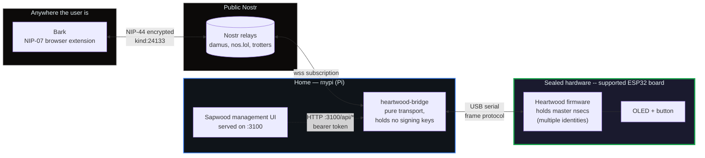
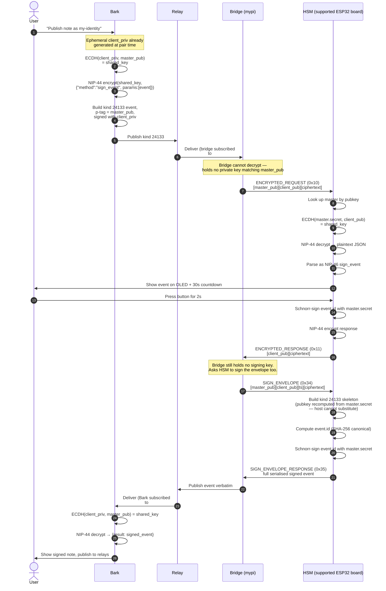
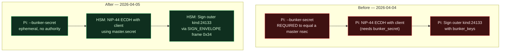
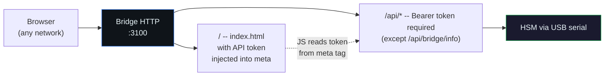
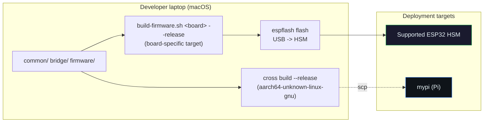

# Heartwood ESP32 — Architecture

How the pieces fit together. For the deeper threat model and the planned
Hard tier refactor see [`docs/plans/2026-04-05-true-zero-trust-bridge.md`](plans/2026-04-05-true-zero-trust-bridge.md).

## System overview

Three independent components and two trust boundaries. The physical button is
the local approval path; exact operator-installed policies are the unattended
path.



The diagram shows USB-bridge mode. In WiFi-standalone mode the firmware itself
holds the outbound relay connection, and a phone running Sapwood reaches its
separate kind-24134 management address through those relays; no inbound port or
Pi is required.

Trust boundaries, from inside out:

1. **HSM** (green). The only place a master nsec exists and the only component that creates master signatures. A request needs either a physical button approval or authority already granted by its exact client-slot policy. Flash encryption is deliberately disabled so the device can be reused; see the separate PIN trade-off in `SECURITY-MODEL.md`.
2. **Pi** (blue, USB mode only). Holds transport/session material but no master signing key. Compromise exposes ciphertext in flight and metadata; it cannot extract a master key or expand an on-device slot policy.
3. **Relays and clients** (grey). Relays see ciphertext and public metadata. A paired client can exercise the exact automatic authority of its slot; it cannot expand that policy.

## What lives where

| Material | Bark | Bridge (Pi) | HSM firmware | Relays |
|---|---|---|---|---|
| Master nsec (identity A) | ✗ | ✗ | ✓ (NVS) | ✗ |
| Master nsec (identity B) | ✗ | ✗ | ✓ (NVS) | ✗ |
| Connect secret (per client slot) | delivered to that client | transiently, if bridged | ✓ (NVS) | encrypted only |
| Bridge session secret | ✗ | ✓ (`bunker.env`, root 0600) | ✓ (NVS) | ✗ |
| Pi bunker/relay secret | ✗ | ✓ (`bunker.env`, root 0600) | ✗ | ✗ |
| API token for Sapwood | ✗ | ✓ (`bunker.env`, root 0600) | ✗ | ✗ |
| Client ephemeral keys | ✓ (Bark storage) | ✗ | ✗ | ✗ |
| Signed NIP-46 envelopes | ✗ | ✗ | ✗ | ✓ (public) |
| NIP-44 encrypted payloads | ✗ | transiently | ✗ (never leaves USB frame) | ✓ (ciphertext) |

Key property: **every row that contains a master nsec has only one tick, and it is in the HSM column.**

## Signing flow — button-required `sign_event` end to end

This sequence is the physical-approval branch: a direct-USB request, a
slot-bound legacy first sign, or a slot configured to ask. An unbound relay
peer is rejected before the button loop. For an exact v2 slot with matching method/kind authority and
`auto_approve=true`, steps 9–10 are replaced by the policy check and the device
signs unattended. Requests outside a strict v2 ceiling are denied, not offered
to the button.



For this branch, step 10 **Press button for 2s** is the authority. The other
legitimate authority source is an exact policy installed by the authenticated
Sapwood operator for a particular client, method set, and optional event-kind
set. Compromise of a paired client is therefore bounded by its slot; compromise
of the operator key is broader because the operator can install or replace such
policies. Neither path exports the master secret.

## Why the bridge holds no signing key

Before the 2026-04-05 refactor, the bridge signed NIP-46 response envelope events itself using `bunker_keys.secret_key()`. For NIP-44 ECDH to line up with the client, that key had to equal a master nsec — which put a signing-capable master key on a network-connected Pi. That defeated the point of having a separate hardware signer.

Today's fix moves both operations to the device:



The `SIGN_ENVELOPE` frame hardcodes `kind=24133` and recomputes the author pubkey from the master secret on-device. A malicious bridge cannot coerce the HSM into signing an arbitrary event via this path — it only ever produces NIP-46 envelopes for masters that are actually loaded on the device.

## The bunker URI

```
bunker://<master_pubkey_hex>
       ?relay=<wss-url>
       &relay=<wss-url>
       ...
       &secret=<connect_secret_hex>
```

Three components:

1. **Master pubkey** — the x-only pubkey of the HSM master you want clients to sign through. Clients NIP-44 encrypt their requests to this pubkey; only the HSM can decrypt.
2. **Relays** — the public mailboxes where Bark publishes requests and the bridge publishes responses. Both sides subscribe and read asynchronously; neither needs direct network reachability.
3. **Connect secret** — 32 random bytes generated on-device for one client slot and stored with that slot in NVS. Clients echo it back on first `connect`. Successful match binds the client key to that slot and its policy; failed match is rejected as `unauthorised`. **It is not a signing key or encryption key — it is a bearer credential proving possession of that slot URI.**

The bridge queries the device for this URI at startup via the `BUNKER_URI_REQUEST` frame and serves it on `GET /api/bridge/info`. The bridge does not generate any part of the URI itself; it is a pure transcriber from the HSM's NVS-stored values.

## Sapwood management plane

Sapwood is a Svelte SPA the bridge serves at `/` from its own HTTP port 3100, alongside a JSON API at `/api/*`.



Two delivery paths for Sapwood:

- **Served from the bridge** (what you get at `http://mypi.local:3100/`). Same-origin, zero friction. The bridge templates the API token into a `<meta name="heartwood-api-token">` tag in `index.html` at serve time, and Sapwood's `http.ts` reads it and sends it on every protected request. No manual token entry.
- **Served from GitHub Pages** (`forgesworn.github.io/sapwood`, no bridge in the picture). Used for the initial-setup Web Serial flow where the browser talks to the HSM directly over USB. The meta tag placeholder stays literal, `http.ts` detects that and sends no auth header.
- **Connected to a WiFi signer by address** (including from a phone in another country). Sapwood signs encrypted kind-24134 requests with the provisioned operator key and exchanges them through the signer's configured relays. Client policy and staged network mutations are remote; seed/PIN/trust-root changes, factory reset, and OTA are not.

Factory reset, seed/PIN changes, and OTA remain USB/local and physically
confirmed where applicable. Client create/approve/update/revoke and staged WiFi
changes are deliberately available to the authenticated relay operator without
a local button; every mutation consumes a durable one-time challenge before it
is applied. The operator key must therefore be backed up and protected as a real
management authority, not treated as a read-only dashboard token.

Numeric client-slot indices are reusable, so every approve/update/revoke or
credential-returning `client_uri` request also names the non-secret SHA-256
fingerprint returned by `list_clients`. A stale phone view therefore cannot act
on, or retrieve the bearer URI for, a different client that later inherited the
same index. Slot writes are read back exactly before success; on failure the
complete prior authority snapshot is restored and written back before a normal
error is returned.

## Threat model in one table

| Attacker capability | What they can do | What they cannot do |
|---|---|---|
| Read relay events | See metadata (who talks to whom, when). See ciphertext. | Decrypt requests or responses. |
| Compromise a paired client | Read its decrypted responses and obtain automatic signatures inside its exact slot method/kind ceiling; legacy requests may still prompt locally. | Extract the master seed or expand/rewrite its own strict policy. |
| Compromise the Sapwood operator key | Create/revoke clients, install bounded signing policies, and stage rollback-safe WiFi changes. | Export/replace the seed, rotate its own trust root, change the PIN, factory-reset, or push firmware remotely. |
| Root on mypi (Pi) | Read/deny ciphertext in flight and use whatever local bridge-management material is configured. | Extract a master seed; bypass the device's policy/approval decision merely by forging a relay envelope. |
| Physical possession of HSM | Read npubs and, without PIN-derived seed encryption, dump plaintext NVS through the ROM bootloader. | Remotely erase the limitations of secure boot/flash encryption; those are explicitly out of scope. |

The coercion-resistance stack (canary + spoken-token + ring-signature + button composition) that mitigates the "user compelled to press button" row is deliberately **out of scope** for this repo and reserved for dedicated grant work.

## Build and flash



- **Firmware** (`firmware/`) cross-compiles via the ESP Rust toolchain (`espup install --toolchain-version 1.87.0.0`). Board selection is compile-time: Heltec V3/V4 target ESP32-S3, T-Display targets classic ESP32, and Waveshare C6 targets ESP32-C6. Each feature selects the matching display and host transport. Use `scripts/build-firmware.sh {v3|v4|tdisplay|c6}` so the feature, target triple, MCU, and `sdkconfig.defaults.<board>` fragment move together. Flashing is via `espflash` over USB.
- **Bridge** (`bridge/`) cross-compiles to `aarch64-unknown-linux-gnu` via the `cross` crate (Docker-based cross build from macOS). The binary gets scp'd to mypi and installed to `/usr/local/bin/heartwood-bridge`.
- **Sapwood** (separate repo, `sapwood/`) builds as a Vite static site and gets rsync'd to `/opt/sapwood/dist` on mypi. The bridge's `--sapwood-dir` flag serves it from `/`.

Secrets live in `/etc/heartwood-esp32-bridge/bunker.env` on mypi (chmod 600, root only). The bridge reads them via `clap`'s `env =` attribute so they never enter `argv` or `systemctl status` output.

## Further reading

- [`docs/plans/2026-04-05-true-zero-trust-bridge.md`](plans/2026-04-05-true-zero-trust-bridge.md) — design note for the future dedicated-transport-key architecture, the Hard tier grant scope.
- [`docs/specs/`](specs/) — protocol specs.
- [`CLAUDE.md`](../CLAUDE.md) — working context, conventions, frozen test vectors.
